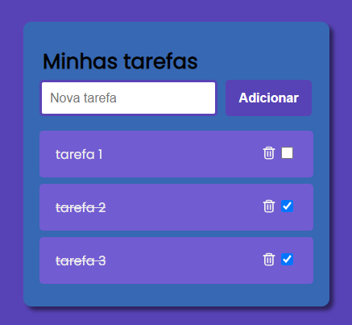

# Todo List React

  
Você pode conferir tambem em: <a href="" target="_blank">task-list</a>

## Objetivo do projeto: 

Colocar em prática aprendizado em ReactJS (hooks)

## Funcionalidades do projeto: 

✅ Adicionar e remover tarefas  
✅ Alterar status para concluída  

## Tecnologias usadas: 

◾ React  
◾ HTML  
◾ CSS  

## Outros

Instalar todas as dependências: `npm install`  
Executar projeto: `npm start` 

## Autor:

Pedro Saito 

</img> 

<a href="https://www.linkedin.com/in/pedrosaito1/" target="_blank">Linkedin</a>